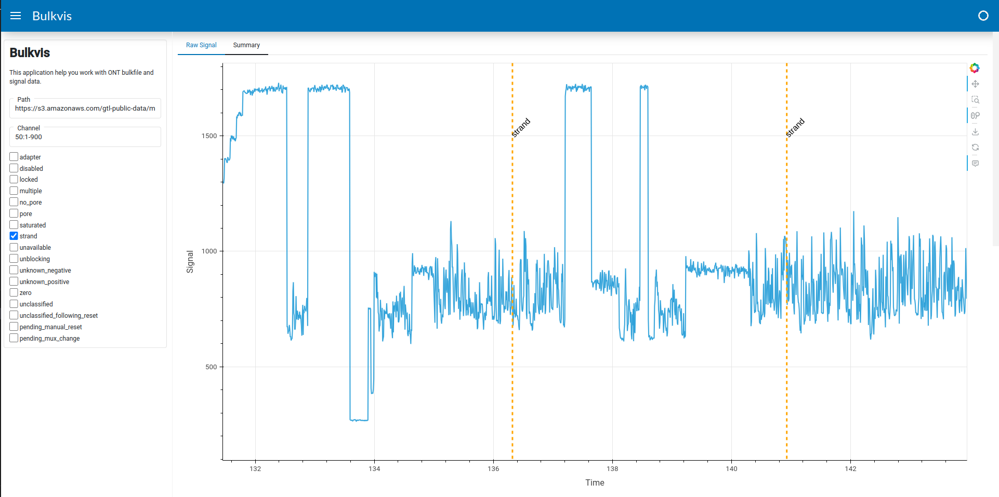

# Bulkvis

## Quickstart

Reimplementation of [bulkvis](https://github.com/LooseLab/bulkvis) using [panel](https://github.com/holoviz/panel).

Feature
- Load bulkfile from local or public s3 bucket (requirs hpy5 from conda-forge)
- Load selected signal instead whole, to improve loading time
- Visualize raw signal and annotations
- Load pod5 from local

## Installation

```
conda env create -f env.yml
```

## Quick Start

```
bulkvis view
```

## Example

Example large bulk data loaded from public s3

