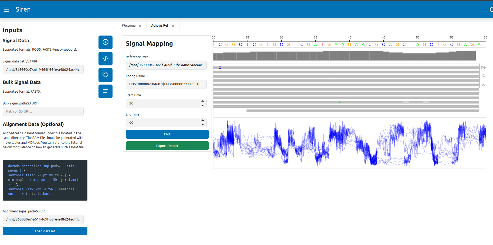

# Siren

A modular interface for nanopore raw data analysis. 

## Quick start

Start app

```
siren
```

Open the app [http://localhost:5006/](http://localhost:5006/)



## Installation

```
git clone https://github.com/satriobio/bulkvis.git
cd bulkvis
pip -e .
```

## License

GNU General Public License v3.0
