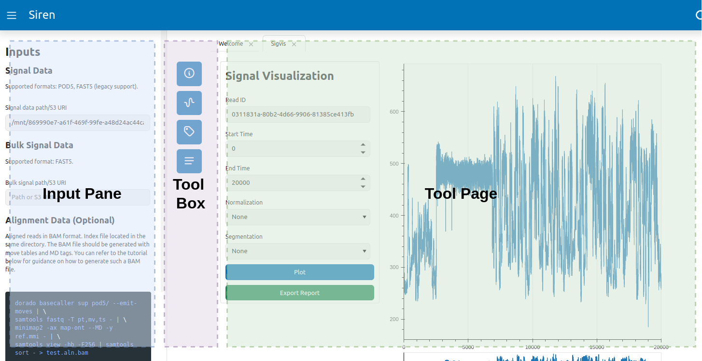
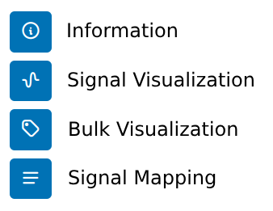
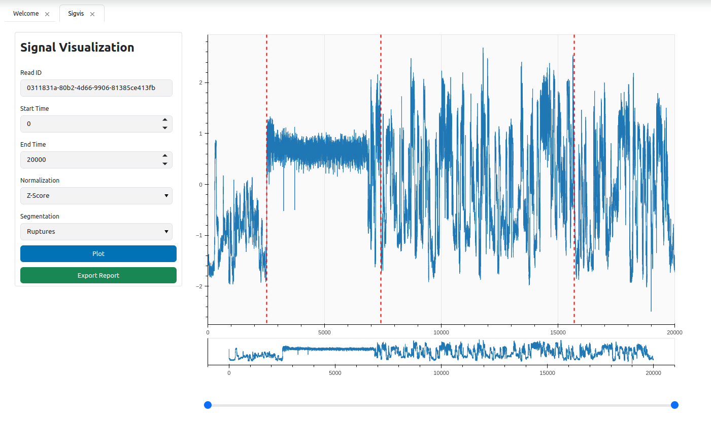
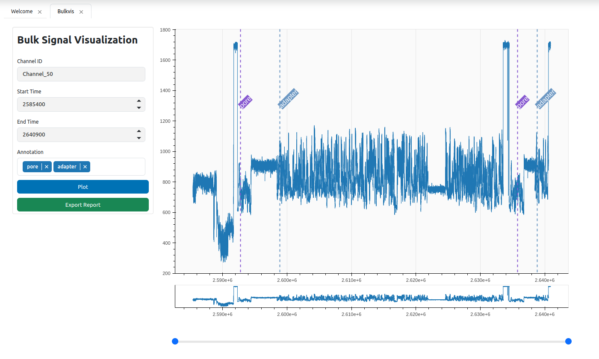
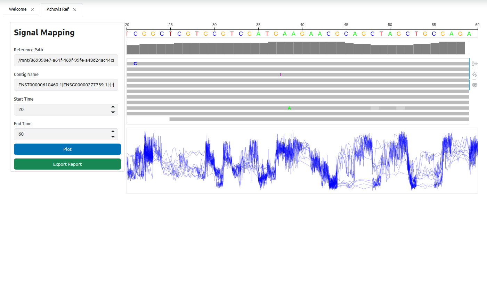

# Usage

## Basic setup

Start app

```
siren
```

Open the app [http://localhost:5006/](http://localhost:5006/)

The app have 3 parts: input pane, tool box, and tool page.



### Input pane

Specifiy input in input pane, use either raw signal file (POD5) or bulk signal file (FAST5). Provide input before select the tool available.

### Toolbox

Currently Siren has 4 tools available. Click tool icon in tool box to open tool page.

- `Signal visualization`
- `Bulk visualization`
- `Signal mapping`




## Signal visualization

Enter read ID, start, and end time to visualize raw signal. Apply normalization or breakpoint calculation if needed.



## Bulk signal visualization

Enter channel ID, start, and end time to visualize bulk raw signal. Select available annotation if needed.



## Signal mapping

### Preparing input

The BAM file should be generated with move tables and MD tags. You can refer to the tutorial below for guidance on how to generate such a BAM file.

```
dorado basecaller sup pod5/ --emit-moves | \
samtools fastq -T pt,mv,ts - | \
minimap2 -ax map-ont --MD -y ref.mmi - | \
samtools view -hb -F256 | samtools sort - > test.aln.bam
```

Enter refence file path, contig name, start, and end time to visualize signal mapping to reference.

